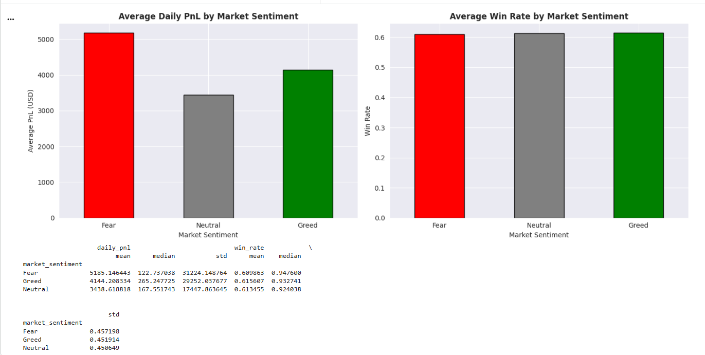
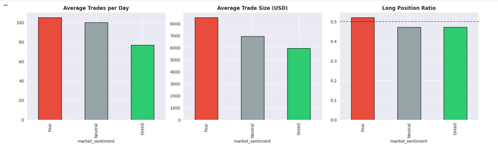
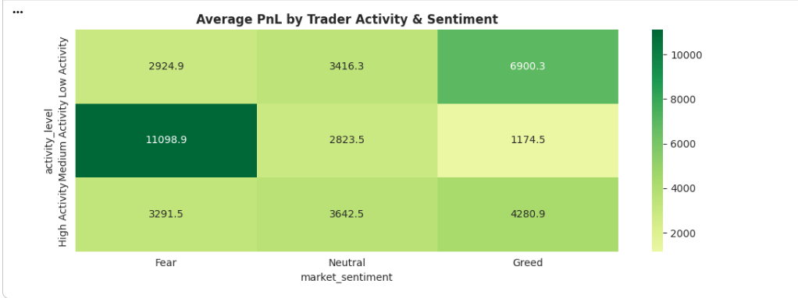

# 📊 Trader Performance vs Market Sentiment Analysis

## 📌 Overview

This project analyzes the relationship between **Bitcoin market sentiment (Fear & Greed Index)** and **trader behavior on Hyperliquid**.

The objective is to understand how sentiment-driven market conditions influence:

* Trader performance (PnL, win rate)
* Risk-taking behavior (trade size, frequency, leverage proxy)
* Position bias (long vs short)

---

## 🎯 Problem Statement

Markets are often driven by emotions — **Fear and Greed**.
This project investigates whether traders adapt their strategies based on sentiment, and whether those changes impact profitability.

---

## 📂 Dataset

Due to file size constraints, datasets are not hosted in this repository.

You can access them here:

* 📁 Historical Trader Data: *((https://drive.google.com/file/d/1-06jj1QwBBvQgrzFRbFyFI5LRKzu4Qa2/view?usp=sharing))*
* 📁 Fear & Greed Index: *((https://drive.google.com/file/d/1ymHYd2rSnOALIejlJ0HPtlR36g0vl5wl/view?usp=sharing))*

---

## ⚙️ Methodology

### 🔹 Data Preparation

* Cleaned and validated both datasets
* Converted timestamps to daily granularity
* Handled missing values and ensured consistency

### 🔹 Data Integration

* Merged trading data with sentiment data using **date as the key**
* Ensured proper alignment between trading activity and market sentiment

### 🔹 Feature Engineering

Constructed key analytical metrics:

* **Daily PnL per trader**
* **Win rate**
* **Trade frequency**
* **Average trade size**
* **Long/Short ratio (position bias)**

---

## 📈 Key Insights

### 🔹 1. Performance vs Market Sentiment



* Trader profitability shows **clear variation across sentiment regimes**
* Greed phases tend to show **higher activity but not always higher efficiency**
* Fear phases often reflect **reduced performance and cautious trading**

---

### 🔹 2. Behavioral Shifts in Different Market Conditions



* Trade frequency increases during **high sentiment periods (Greed)**
* Average trade size fluctuates, indicating **changing risk appetite**
* Long/short bias shifts, suggesting **sentiment-driven directional bets**

---

### 🔹 3. Trader Segmentation Analysis



* High-activity traders behave differently from low-activity traders across sentiment cycles
* Certain trader segments perform consistently regardless of sentiment
* Others are highly **sensitive to market emotions**, leading to volatile outcomes

---

## 💡 Strategy Recommendations

Based on observed patterns:

* 📉 **Risk Management in Fear Markets**
  Reduce position sizes and avoid aggressive trades during Fear phases

* 📈 **Controlled Aggression in Greed Markets**
  While opportunities increase, avoid overtrading and excessive risk-taking

* 🎯 **Focus on Consistency over Frequency**
  High-frequency trading does not guarantee profitability — disciplined strategies perform better

---

## 🧠 (Bonus) Predictive Modeling

A simple classification model was built to predict **profitable vs non-profitable trading days** using:

* Sentiment value
* Trading behavior features

👉 The model highlights that **behavioral features + sentiment together** can provide predictive signals.

---

## 🛠️ Tech Stack

* **Python**
* **Pandas, NumPy** (Data Processing)
* **Matplotlib, Seaborn** (Visualization)
* **Scikit-learn** (Modeling)
* **Google Colab**

---

## ▶️ How to Run

1. Open the notebook in Google Colab
2. Upload both datasets
3. Run all cells sequentially

---

## 📌 Repository Structure

```
trader-sentiment-analysis/
│
├── Trader_Sentiment_Analysis.ipynb
├── README.md
├── insight1_performance.png
├── insight2_behavior.png
├── insight3_heatmap.png
```

---

## 👤 Author

**Hemanth Love**

---

## 🚀 Final Note

This project demonstrates how combining **market sentiment with behavioral data** can uncover actionable insights for trading strategies and risk management.
